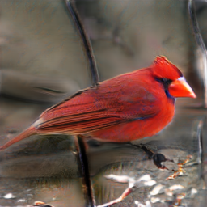
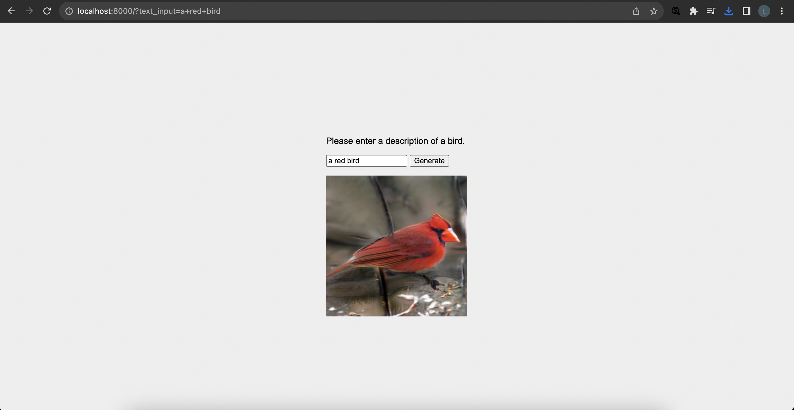

# Recurrent-Affine-Transformation-for-Text-to-image-Synthesis

Clone this repo.
```
git clone https://github.com/leacornelio/text-to-image.git
cd text-t-image
```

### Dependencies
Create virtual environment and install dependencies
```
python3 -m venv venv
source venv/bin/activate
pip install -r requirements.txt

```
Go to working directory
```
cd code/
```

### Datasets Preparation
1. Download the preprocessed metadata for [birds](https://drive.google.com/open?id=1O_LtUP9sch09QH3s_EBAgLEctBQ5JBSJ) and save them to `data/`
2. Download the [birds](http://www.vision.caltech.edu/visipedia/CUB-200-2011.html) image data. Extract them to `data/birds/`. Raw text data of CUB dataset is avaiable [here](https://drive.google.com/file/d/1KyTQVo67izP4NEAAZBRnqrGG3yRh3azD/view?usp=sharing)

---
### Training
Set B_Validation in cfg/bird.yml to False
  - `python main.py --cfg cfg/bird.yml`

Number of parameters: 38091658

### Evaluating
1. Download the trained model [here](https://drive.google.com/file/d/18I65bmpqQ-mIbZu51ditSynOzTA8A6XI/view?usp=sharing) and save to `models/`.
2. Set B_Validation in cfg/bird.yml to True.
  - `python main.py --cfg cfg/bird.yml`

Metrics is calculated using the Frechet Inception Distance (FID) module of torchmetrics. The [pre-trained model](https://drive.google.com/file/d/1Np4odfdNkgRursGeKmwVix3zLhiZfZUa/view?usp=sharing) is trained for an additional 1 epoch and 1 step for demo purposes.
```
FID: 1.28
```
Sample input: 'a red bird'

Output:



### Web App
Creating a web app
1. Create a project
```
python manage.py startapp image_generator
```
2. Add necessary functions to build the workflow to `views.py`
3. Add functions in `views.py` to `urls.py`
4. Build the UI. Add `.html`, `.js`, and `.css` files to `templates/`.
5. Add a `static` directory to store the output images
  - Add this line to the template file
    ```
    
    ```
  - Refer to the image in the `static` directory
    ```
    
    ```
  - Add the following lines in `settings.py`
    ```
    STATIC_ROOT = os.path.join(BASE_DIR, 'staticfiles')

    STATICFILES_DIRS = [
        os.path.join(BASE_DIR, "static"),
    ]
    ```
  - Go to the Django app root and run
    ```
    python manage.py collectstatic
    ```

Running and accessing the app
1. Run the Django webserver
```
cd ../image_generator
python manage.py runserver
```
2. Go to `127.0.0.1:8000`.
3. Enter a description of a bird as prompt.
4. Click the Generate button.


---
### Reference

```
@article{ye2022recurrent,
  title={Recurrent Affine Transformation for Text-to-image Synthesis},
  author={Ye, Senmao and Liu, Fei and Tan, Minkui},
  journal={arXiv preprint arXiv:2204.10482},
  year={2022}
}
```